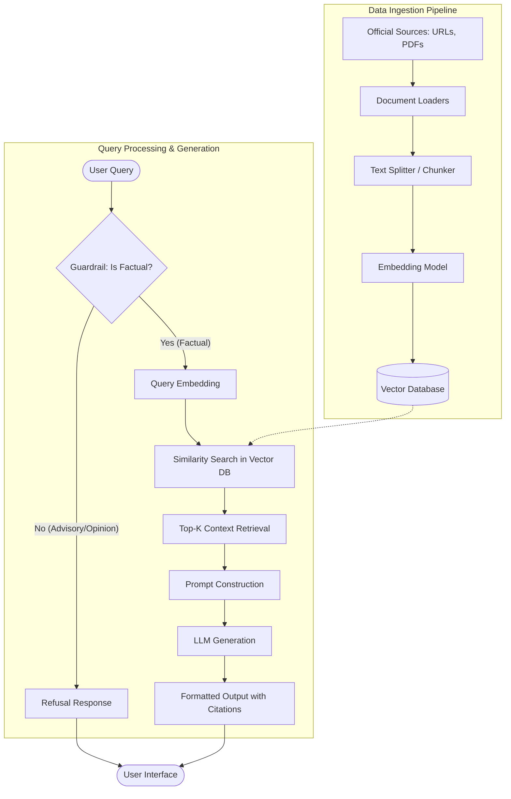

# Architecture: Mutual Fund FAQ Assistant (Facts-Only)

## 1. System Overview
The system is built on a **Retrieval-Augmented Generation (RAG)** architecture. It ingests official mutual fund documents, indexes them into a vector database, and uses a Large Language Model (LLM) strictly for generating concise, facts-only answers based solely on retrieved context.

## 2. High-Level Architecture Diagram
*(Conceptual flow of the system)*

## 3. Core Components

### 3.1. Data Ingestion Pipeline
* **Data Sources:** 15-25 URLs (Factsheets, KIM, SID) across the 5 selected funds.
* **Document Loaders:** Tools to parse HTML pages and PDF documents to extract raw text (e.g., `LangChain` document loaders, `PyPDF`).
* **Text Chunker:** A three-pass pipeline: (1) Split by Markdown headers to preserve section context, (2) Recursively split large sections into overlapping chunks (1500 characters, 200 character overlap), (3) Post-process to filter out site navigation noise and fragment chunks.
* **Embedding Model:** Converts text chunks into dense vector representations using the BGE model.
* **Vector Database:** A lightweight, persistent vector store (e.g., `ChromaDB` or `FAISS`) to store embeddings and metadata (source URLs, timestamps).

### 3.2. Query Processing & Guardrails
* **Input Layer:** Receives the user's query via the UI.
* **Guardrail Module:** Before retrieval, the query is evaluated to determine if it is advisory ("Should I buy this?") or explicitly prohibited (return calculations or performance comparisons).
  * If flagged, the system immediately returns a standard refusal response along with educational links (AMFI/SEBI).
  * For performance-related queries, the system must bypass generation and only provide a direct link to the official factsheet.
  * If purely factual, the query proceeds to the embedding phase.

### 3.3. Retrieval & Generation
* **Semantic Search:** The query is embedded using the same model from the ingestion pipeline. The system retrieves the Top-K most relevant document chunks from the Vector DB.
* **Prompt Assembly:** The system constructs a strict prompt containing:
  1. The user's query.
  2. The retrieved document chunks.
  3. System instructions enforcing constraints (max 3 sentences, facts-only, mandatory citation).
* **LLM Engine:** A fast LLM accessed via Groq generates the final answer based purely on the prompt.

### 3.4. Output Formatting
The system post-processes the LLM output to ensure it meets formatting requirements:
* Extracts the factual answer text.
* Appends exactly one clear source link (retrieved from the used chunk's metadata).
* Appends the footer: `Last updated from sources: <date>`.

## 4. User Interface
A minimal interface (e.g., `Streamlit`, `Gradio`, or a basic React app) featuring:
* Welcome message & Example Queries.
* A prominent disclaimer: **"Facts-only. No investment advice."**

## 5. Security & Privacy
* **Stateless Processing:** The system does not collect, store, or process personally identifiable information (PII) such as PAN, Aadhaar, account numbers, OTPs, email addresses, or phone numbers.
* **Sandboxed Knowledge:** The LLM is strictly instructed to refuse answering questions if the answer is not present in the retrieved context, effectively preventing hallucinations and unauthorized advice.
